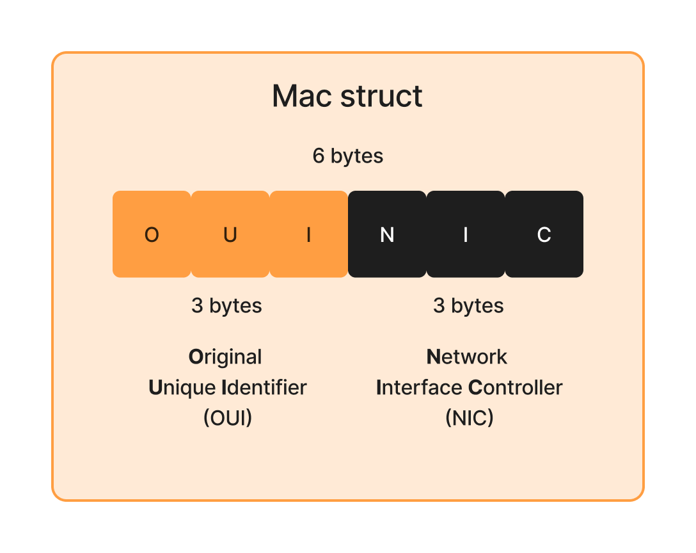
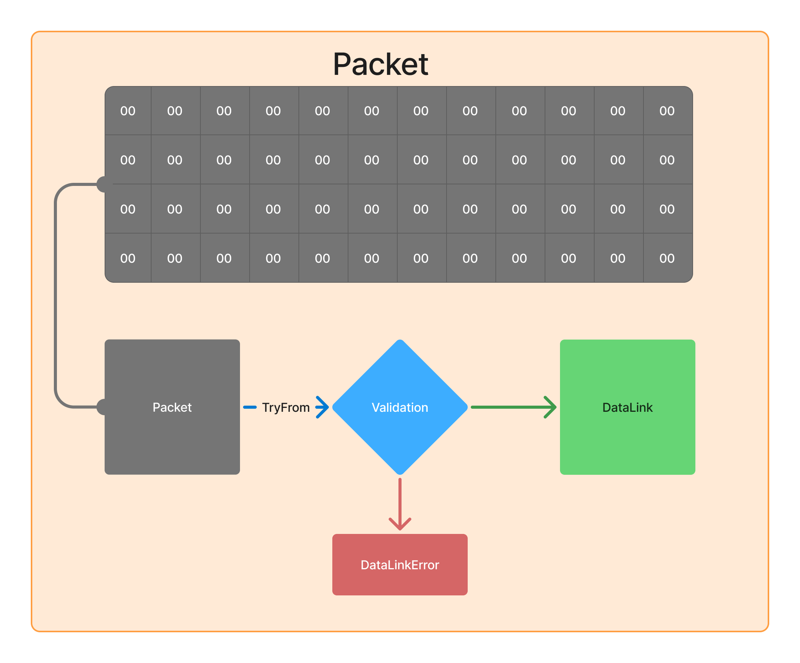
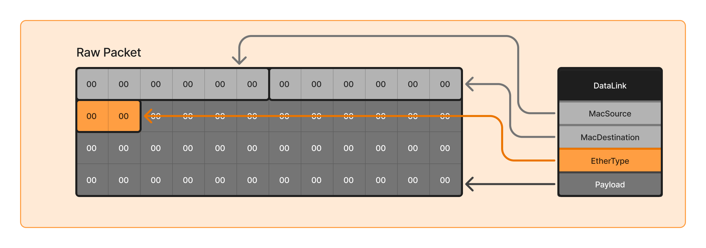

# Chapter 1

### **Parsing the Data Link Layer from a Raw Packet**
Understanding how to parse the **Data Link Layer** from raw packets is a crucial step in network packet analysis. The Data Link Layer provides essential information such as **MAC addresses, Ethertype, and payload extraction**. This section explains the approach I took to implement the `DataLink` structure parsing.

---

## **🧩 Understanding the Data Link Structure**
The Data Link Layer is responsible for **frame-level communication** between devices on the same network segment. In an **Ethernet frame**, the structure is as follows:

The main components are:
1. **Destination MAC Address** (6 bytes) - The unique physical identifier of the receiving network hardware.
2. **Source MAC Address** (6 bytes)
3. **Ethertype** (2 bytes) – Determines the protocol encapsulated in the payload.
4. **Payload** (Variable length) – Contains the encapsulated network-layer packet (ipv4, arp, etc ...).

---

### **Breaking Down the MAC Address Structure**
To parse MAC addresses correctly, we need to ensure that:
- They are always **6 bytes long**.
- They are formatted properly for readability.
- We extract **Organizationally Unique Identifiers (OUI)** to identify the manufacturer.

**MAC Address Structure:**

---

### **Breaking Down the Ethertype Field**
The **Ethertype** is a 2-byte field that defines the **type of payload** carried by the frame.

📌 **Key Considerations:**
- Extract the 2-byte **big-endian** value.
- Map **well-known Ethertypes** (IPv4, IPv6, ARP, etc.).
- Allow handling of **unknown protocols** without failure.

📌 **Example of Well-Known Ethertypes (IEEE Standard Correspondence Table):**

| Ethertype (Hex) | Protocol |
|----------------|----------|
| `0x0800` | IPv4 |
| `0x86DD` | IPv6 |
| `0x0806` | ARP |
| `0x8100` | VLAN Tagging |

---

## **📌 Steps Taken to Parse the Data Link Layer**
To correctly extract this information, I followed these key steps:

### **Validations**
While parsing, I implemented **validations** to ensure the raw packet is coherent.

📌 **Validations Performed:**

✅ **Packet Minimum Length Check** – Ensure the packet is at least **14 bytes** (`MAC_DST + MAC_SRC + Ethertype`).  
✅ **Macaddress Minimum Length Check** – at least **6 bytes**.  
✅ **etherthype ceherence** – if ethertype is ipv4 or ipv6 the payload can't be empty.  

### **Structuring the Parsed Packet**
After extracting all components, I structured the parsed frame in a clear format. This makes it easier to **analyze, debug, and process packets** dynamically.

📌 **Why Structure Matters?**
- Improves **readability** of parsed data.
- Makes it **easier to extract key information**.
- Supports **future protocol extensions**.

---

## **🚀 Conclusion**
Parsing the **Data Link Layer** requires **careful validation** and **structured extraction**. By following a modular approach:
- **MAC addresses** are extracted safely.
- **Ethertype** is correctly mapped.
- **Payload validation** prevents out-of-bounds errors.
- The structure is **extensible** for future protocols.

This foundational parsing is crucial for **higher-layer analysis**, such as decoding **IP, TCP, UDP, and application-level protocols**.

🚀 **Next Steps:** Exploring **network-layer parsing (IPv4/IPv6)**!

