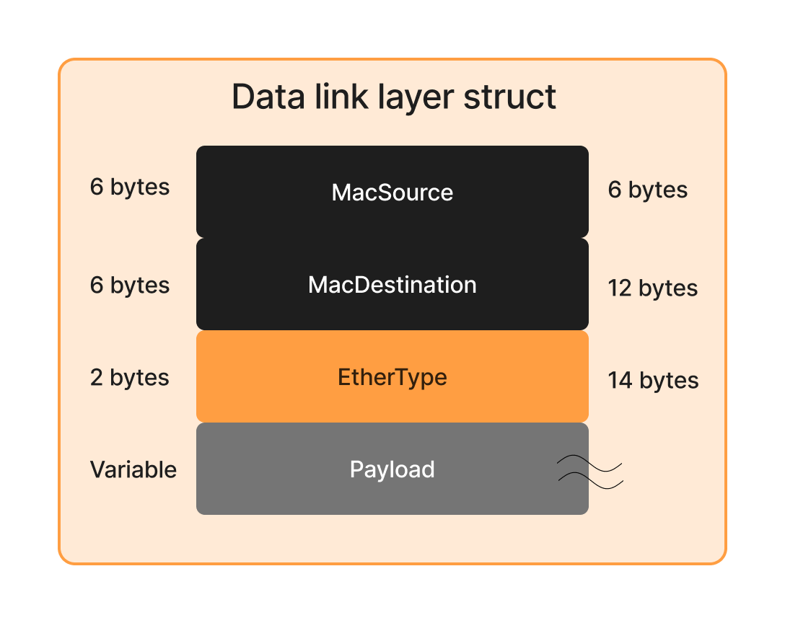
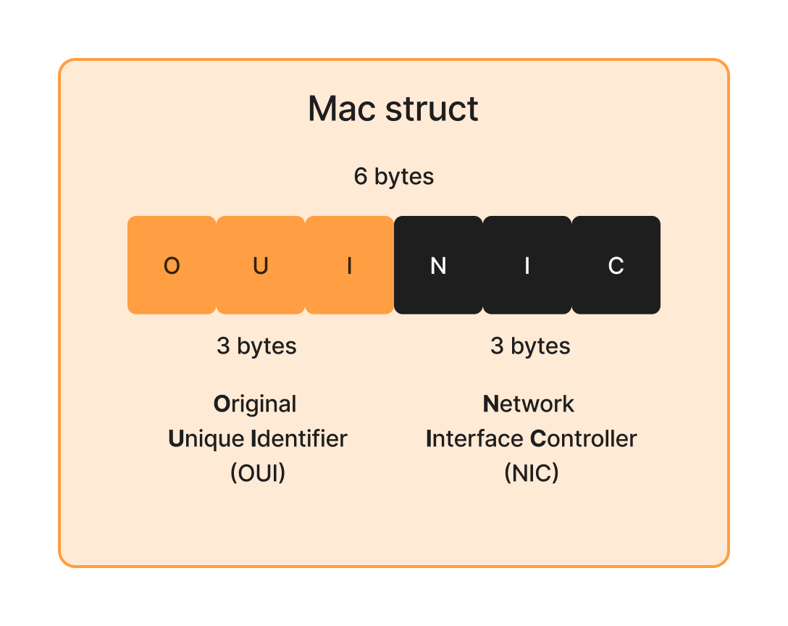
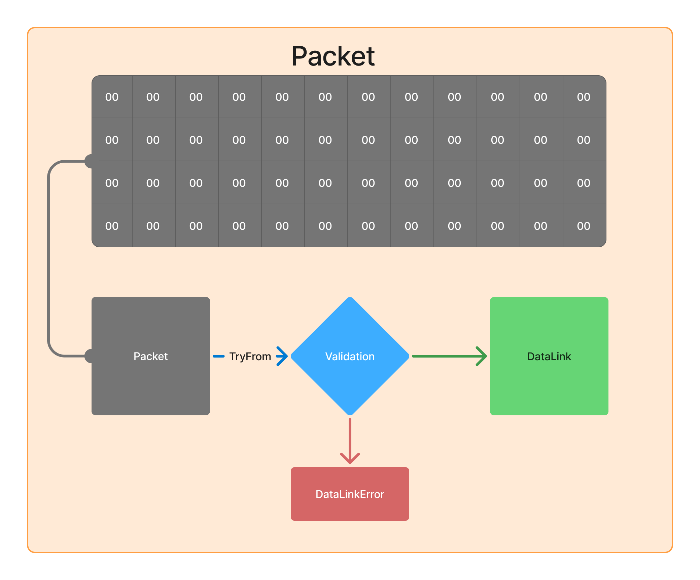
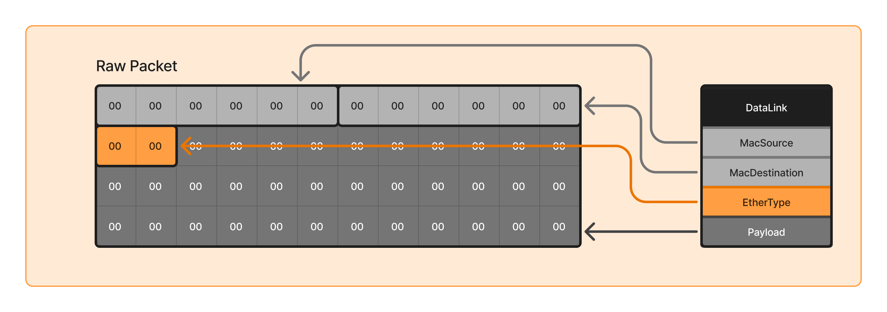

# Data link

### **Parsing the link layer from a raw packet**
Understanding how to parse the **link layer** from raw packets is a crucial step in network packet analysis. It provides essential information such as **MAC addresses, Ethertype, and payload extraction**. This section explains the approach I took to implement the `DataLink` structure parsing, and how it later generalized to the non-Ethernet capture formats.

---

## **🧩 Understanding the Data Link Structure**
The Data Link Layer is responsible for **frame-level communication** between devices on the same network segment. In an **Ethernet frame**, the structure is as follows:



The main components are:
1. **Destination MAC Address** (6 bytes) - The unique physical identifier of the receiving network hardware.
2. **Source MAC Address** (6 bytes)
3. **Ethertype** (2 bytes) – Determines the protocol encapsulated in the payload.
4. **Payload** (Variable length) – Contains the encapsulated network-layer packet (ipv4, arp, etc ...).

```rust
pub struct DataLink<'a> {
    pub destination_mac: MacAddress,
    pub source_mac: MacAddress,
    pub vlan: Option<VlanTag>,
    pub ethertype: Ethertype,
    pub payload: &'a [u8],
}
```

---

### **Breaking Down the MAC Address Structure**
To parse MAC addresses correctly, we need to ensure that:
- They are always **6 bytes long**.
- They are formatted properly for readability.
- We extract **Organizationally Unique Identifiers (OUI)** to identify the manufacturer.

**MAC Address Structure:**


`MacAddress` is a `[u8; 6]` newtype, not a `String`. It only becomes
`"aa:bb:cc:dd:ee:ff"` when displayed or serialized, so a parsed frame carries six
bytes instead of a heap allocation. OUI resolution is internal to the crate.

---

### **Breaking Down the Ethertype Field**
The **Ethertype** is a 2-byte field that defines the **type of payload** carried by the frame.

📌 **Key Considerations:**
- Extract the 2-byte **big-endian** value.
- Map **well-known Ethertypes** (IPv4, IPv6, ARP, etc.).
- Allow handling of **unknown protocols** without failure.

`Ethertype` is a `u16` newtype for the same reason `LinkType` is: an unknown
value is **kept**, not collapsed into an `Unknown` variant. `static_name()`
returns the well-known name without allocating, or `None`.

📌 **Example of Well-Known Ethertypes (IEEE Standard Correspondence Table):**

| Ethertype (Hex) | Protocol |
|----------------|----------|
| `0x0800` | IPv4 |
| `0x86DD` | IPv6 |
| `0x0806` | ARP |
| `0x8100` | VLAN Tagging |

### **VLAN tags (802.1Q)**

An `0x8100` EtherType is not a protocol, it is a 4-byte insertion before the real
one. The tag is decoded into its own structure and the *inner* EtherType is what
drives L3 parsing:

```rust
pub struct VlanTag {
    pub id: u16,              // 12 bits, 0–4095
    pub pcp: u8,              // Priority Code Point, 0–7
    pub dei: bool,            // Drop Eligible Indicator
    pub inner_ethertype: Ethertype,
}
```

---

## **📌 Steps Taken to Parse the Data Link Layer**
To correctly extract this information, I followed these key steps:



### **Validations**
While parsing, I implemented **validations** to ensure the raw packet is coherent.

📌 **Validations Performed:**

✅ **Packet Minimum Length Check** – Ensure the packet is at least **14 bytes** (`MAC_DST + MAC_SRC + Ethertype`).
✅ **Macaddress Minimum Length Check** – at least **6 bytes**.
✅ **etherthype ceherence** – if ethertype is ipv4 or ipv6 the payload can't be empty.

⚠️ Note what is **not** on that list: nothing verifies that the bytes *are*
Ethernet. There is no such check to write — any 14 bytes form a syntactically
valid Ethernet header. This is precisely why `DataLink::try_from(&[u8])` is a
compatibility shortcut and the canonical entry point takes an explicit LINKTYPE.
See [Link types](./link_types.md).

### **Structuring the Parsed Packet**
After extracting all components, I structured the parsed frame in a clear format. This makes it easier to **analyze, debug, and process packets** dynamically.

📌 **Why Structure Matters?**
- Improves **readability** of parsed data.
- Makes it **easier to extract key information**.
- Supports **future protocol extensions**.



---

## **Beyond Ethernet: the `LinkLayer` wrapper**

Ethernet was the original — and for a while, only — assumption. Captures broke
it: `tcpdump -i any` yields Linux cooked frames, tunnels yield 802.11, some
sources yield bare IP with no link header at all.

Rather than teach `DataLink` to be five things, the frame types stay separate and
a wrapper carries them along with the LINKTYPE they came from:

```rust
pub struct LinkLayer<'a> {
    link_type: LinkType,
    network_protocol: NetworkProtocol,
    network_payload: &'a [u8],
    kind: LinkLayerKind<'a>,
}
```

Two things are common to every format and therefore exposed generically:

- `network_protocol()` → `NetworkProtocol` (`Ipv4`, `Ipv6`, `Arp`, `Profinet`,
  `Other(u16)`) — a format-neutral answer to "what is next?", because RAW and SLL
  have no EtherType to give.
- `network_payload()` → the borrowed L3 slice.

Everything format-specific goes through an explicit, fallible accessor:

```rust
match flow.data_link.kind() {
    LinkLayerKind::Ethernet(eth)  => println!("{} -> {}", eth.source_mac, eth.destination_mac),
    LinkLayerKind::LinuxSll(sll)  => println!("cooked v1, arphrd={:?}", sll),
    LinkLayerKind::LinuxSll2(s2)  => println!("cooked v2, ifindex kept"),
    LinkLayerKind::RawIp(_)       => println!("no link header"),
    LinkLayerKind::Ieee80211(_)   => println!("wireless frame"),
}
```

There is deliberately **no** `source_mac()` on `LinkLayer`. A cooked-capture
frame has a source address of a declared length that may not be a MAC, and a RAW
IP packet has none at all — an accessor returning something plausible for those
would be inventing data. The per-format notes for SLL v1, SLL v2 and RAW IP are
in [Link types](./link_types.md).

---

## **🚀 Conclusion**
Parsing the link layer requires **careful validation** and **structured extraction**. By following a modular approach:
- **MAC addresses** are extracted safely.
- **Ethertype** is correctly mapped.
- **Payload validation** prevents out-of-bounds errors.
- The structure is **extensible** for future formats — which is exactly what
  happened when SLL, SLL2, RAW and 802.11 arrived.

This foundational parsing is crucial for **higher-layer analysis**, such as decoding **IP, TCP, UDP, and application-level protocols**.

🚀 **Next Steps:** Exploring **internet-layer parsing (IPv4/IPv6)**!
