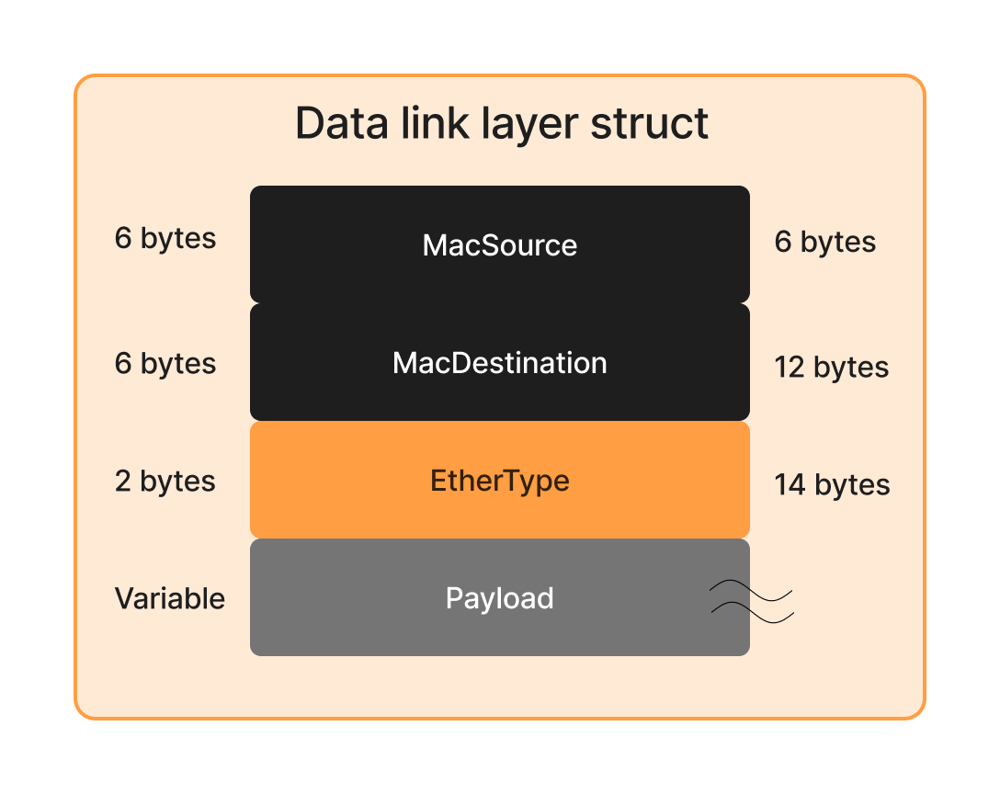
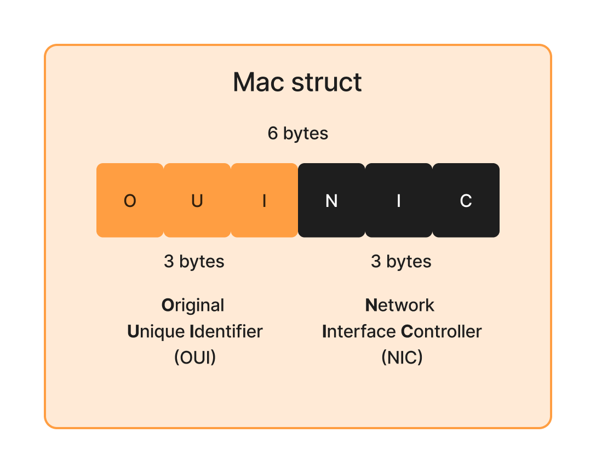
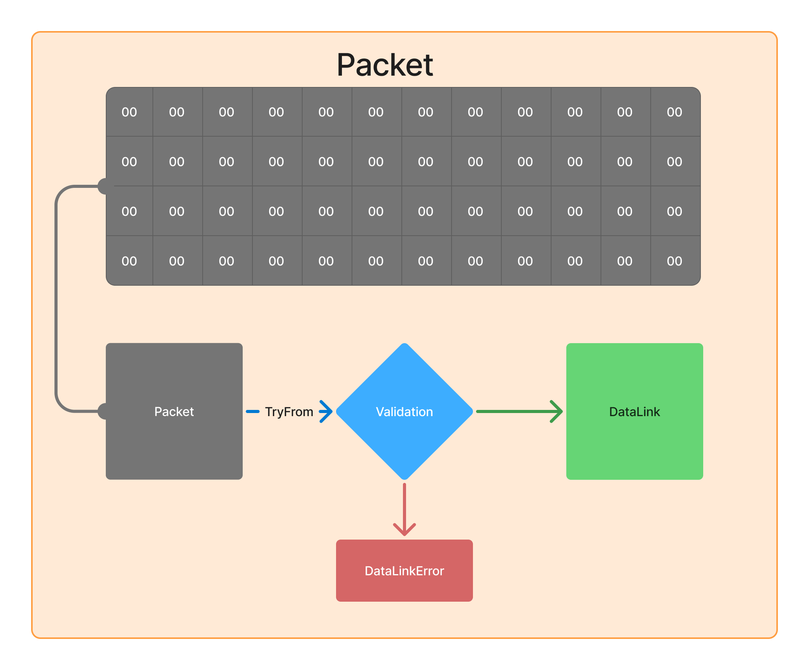
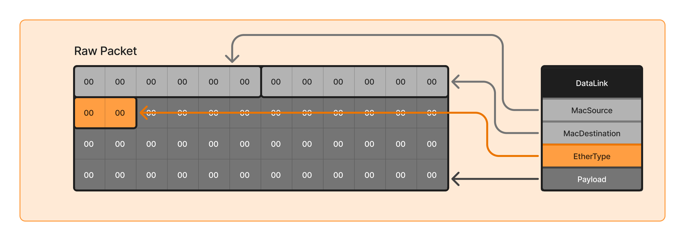

# Data link

### **Parsing the Data Link Layer from a Raw Packet**
Understanding how to parse the **Data Link Layer** from raw packets is a crucial step in network packet analysis. The Data Link Layer provides essential information such as **MAC addresses, EtherType, and payload extraction**. This section explains the approach I took, first for Ethernet, then for the other link formats a capture can contain.

---

## **🧩 Understanding the Ethernet Frame**
The Data Link Layer is responsible for **frame-level communication** between devices on the same network segment. In an **Ethernet frame**, the structure is as follows:



The main components are:
1. **Destination MAC Address** (6 bytes) - the unique physical identifier of the receiving network hardware.
2. **Source MAC Address** (6 bytes)
3. **EtherType** (2 bytes) – determines the protocol encapsulated in the payload.
4. **Payload** (variable length) – contains the encapsulated network-layer packet (IPv4, ARP, etc.).

---

### **Breaking Down the MAC Address Structure**
To parse MAC addresses correctly, we need to ensure that:
- They are always **6 bytes long**.
- They are formatted properly for readability.
- We extract **Organizationally Unique Identifiers (OUI)** to identify the manufacturer.

**MAC Address Structure:**


```rust
pub struct MacAddress(pub [u8; 6]);

impl MacAddress {
    pub const fn is_broadcast(&self) -> bool;
    /// The I/G bit of the first byte: broadcast is multicast too.
    pub const fn is_multicast(&self) -> bool;
    pub const fn is_unicast(&self) -> bool;
    /// "ASUSTek:3c:4d:5e" when the OUI is known (the manufacturer replaces
    /// the first three bytes), "00:1a:2b:3c:4d:5e" otherwise.
    pub fn display_with_oui(&self) -> String;
    pub fn get_oui(&self) -> Oui;
}
```

The OUI table is embedded in the crate: no file to load, no network lookup. It is also short: a `match` on seven prefixes (ASUSTek, Intel, Sagemcom, three Siemens prefixes and `PnMc`, the PROFINET multicast prefix `01:0e:cf`), not the IEEE registry. Any other prefix is `Oui::Unknown`, and `display_with_oui()` falls back to the plain address.

---

### **Breaking Down the EtherType Field**
The **EtherType** is a 2-byte field that defines the **type of payload** carried by the frame.

📌 **Key Considerations:**
- Extract the 2-byte **big-endian** value.
- Map **well-known EtherTypes** (IPv4, IPv6, ARP, etc.).
- Allow handling of **unknown protocols** without failure: `Ethertype(pub u16)` is a plain newtype, an unknown value is preserved, and `static_name()` returns `None` for it.

📌 **Example of Well-Known EtherTypes:**

| EtherType (Hex) | Protocol |
|----------------|----------|
| `0x0800` | IPv4 |
| `0x86DD` | IPv6 |
| `0x0806` | ARP |
| `0x8892` | Profinet |
| `0x88CC` | LLDP |
| `0x8100` | VLAN tag (802.1Q) |
| `0x88A8` / `0x9100` | Service tag (802.1ad / legacy QinQ) |

Naming is not decoding. Only the four values that `NetworkProtocol` maps (IPv4, IPv6, ARP, Profinet) reach an L3 decoder; LLDP, MRP (`0x88E3`) and the rest of the name table only get a readable name, and `internet` stays `None`. The TPIDs never survive as the parsed `ethertype`: the parser consumes the tags they announce.

---

### **VLAN tags**

When the EtherType is a **TPID** (`0x8100`, `0x88A8` or `0x9100`), the next 4 bytes are a VLAN tag (TCI + the following EtherType), and that EtherType may itself be a TPID: 802.1ad puts an S-tag in front of the C-tag, and some equipment stacks two `0x8100`. The parser **consumes the whole stack** so that `ethertype` and `payload` always describe the real layer 3:

```rust
#[non_exhaustive]
pub struct DataLink<'a> {
    pub destination_mac: MacAddress,
    pub source_mac: MacAddress,
    /// The innermost tag (the customer VLAN), if any.
    pub vlan: Option<VlanTag>,
    /// The whole stack, outermost first (S-tag then C-tag).
    pub vlan_stack: VlanStack<'a>,
    /// The real layer-3 EtherType, after the tags.
    pub ethertype: Ethertype,
    pub payload: &'a [u8],
}

pub struct VlanTag {
    pub id: u16,      // VLAN identifier (12 bits)
    pub pcp: u8,      // priority code point (3 bits)
    pub dei: bool,    // drop eligible indicator
    pub inner_ethertype: Ethertype,
}
```

`vlan_stack.outer()` gives the S-VLAN, `vlan_stack.inner()` the same tag as `vlan`, and `vlan_stack.iter()` walks the stack from outer to inner. `VlanStack` is a zero-copy view over the tag bytes of the frame: no allocation, whatever the depth ([#82](https://github.com/Akmot9/Packet-parser/issues/82)). It takes part in equality and hashing, so two frames that differ only by their S-tag are two flows, and it is serialized only when at least two tags are stacked, so the JSON of untagged and single-tagged frames did not change when it appeared in 11.0.0.

The untagged case is the hot path and stays a straight line; the stack is unrolled in a separate `#[inline(never)]` function, because unrolling it inline cost about 13 ns on every frame, tagged or not (measured on the reference packet).

---

## **📌 Steps Taken to Parse the Ethernet Frame**
To correctly extract this information, I followed these key steps:



### **Validations**
While parsing, I implemented **validations** to ensure the raw packet is coherent.

📌 **Validations Performed:**

✅ **Frame minimum length** – the packet is at least **14 bytes** (`MAC_DST + MAC_SRC + EtherType`), otherwise `DataLinkError::DataLinkTooShort { required, actual }`.  
✅ **VLAN stack length** – re-checked **at each tag consumed**: `14 + 4 × tags` bytes, so a frame truncated in the middle of the stack reports `DataLinkTooShort` instead of an out-of-bounds access.  
✅ **MAC address length** – exactly **6 bytes**, `MacParseError::InvalidLength` otherwise (unreachable from `DataLink::try_from`, since the frame length is already proven; it protects the direct `MacAddress::try_from`).  

These are the errors of `DataLink::try_from` called directly. Through `parse`, the Ethernet decoder converts them into `LinkLayerError::Truncated` (see [One error path](#one-error-path)): since 11.0.0, `DataLinkError` is no longer part of `ParseError`.

The EtherType is *not* validated: an unknown value is a valid frame carrying a protocol we do not decode, and the internet layer will simply be `None`.

```rust
/// Ethernet II header: two MACs and an EtherType.
const DATALINK_HEADER_LEN: usize = 14;

impl<'a> TryFrom<&'a [u8]> for DataLink<'a> {
    type Error = DataLinkError;

    fn try_from(packets: &'a [u8]) -> Result<Self, Self::Error> {
        validate_data_link_length(packets)?;

        let destination_mac = MacAddress::try_from(&packets[0..6])?;
        let source_mac = MacAddress::try_from(&packets[6..12])?;

        let raw_ethertype = u16::from_be_bytes([packets[12], packets[13]]);
        if VlanTag::is_tpid(raw_ethertype) {
            return Self::parse_tagged(packets, destination_mac, source_mac, raw_ethertype);
        }

        Ok(DataLink {
            destination_mac,
            source_mac,
            vlan: None,
            vlan_stack: VlanStack::default(),
            ethertype: Ethertype::from(raw_ethertype),
            payload: &packets[DATALINK_HEADER_LEN..],
        })
    }
}
```

Called directly, `DataLink::try_from` **assumes Ethernet**: it checks lengths, never that the bytes *are* Ethernet, so a Linux SLL frame comes back `Ok` with fabricated MAC addresses. It is kept for compatibility and announced for removal in a future major release. Inside the crate it is only called where something declares Ethernet: the LINKTYPE (Ethernet, 802.3br express mPackets) or a tunnel header (VXLAN, and GRE or Geneve announcing `0x6558`).

### **Structuring the Parsed Frame**
After extracting all components, I structured the parsed frame in a clear format. This makes it easier to **analyze, debug, and process packets** dynamically.



---

## **🌐 Beyond Ethernet: `LinkType` and `LinkLayer`**

A capture is not always Ethernet. A capture on the Linux `any` interface is *Linux cooked* (SLL), a VPN capture is often *RAW IP*, an industrial capture can be *802.3br*. The bytes of these formats look nothing like an Ethernet header, and nothing in them says which format they are: **only the capture file knows**, through its LINKTYPE.

That is why `parse` takes a `LinkType` and never guesses. `LinkType(pub u32)` uses the canonical `LINKTYPE_*` values stored in PCAP/PCAPNG files, and stays open: an unknown value is preserved, not collapsed into an `Unknown` variant. `parse` never reads a capture file, so mapping the capture source to this namespace is the caller's job: a `DLT_*` value from a live capture must be normalized when it differs from the `LINKTYPE_*` value, and a PCAPNG reader passes the LINKTYPE of the interface each packet references.

```rust
/// Single source of truth for the link types backed by a decoder.
#[inline(always)]
const fn decoder_for(link_type: LinkType) -> Option<DecoderKind> {
    match link_type {
        LinkType::ETHERNET => Some(DecoderKind::Ethernet),
        // BSD loopback: four bytes of address family, then the IP packet.
        LinkType::NULL => Some(DecoderKind::NullLoopback),
        // RAW, IPV4 and IPV6 share the same shape: the bytes start directly
        // at the IP header. RawIpDecoder reads the version from the first
        // nibble, which covers all three without a dedicated decoder.
        LinkType::RAW => Some(DecoderKind::RawIp(LinkType::RAW)),
        LinkType::IPV4 => Some(DecoderKind::RawIp(LinkType::IPV4)),
        LinkType::IPV6 => Some(DecoderKind::RawIp(LinkType::IPV6)),
        LinkType::LINUX_SLL => Some(DecoderKind::LinuxSll),
        LinkType::LINUX_SLL2 => Some(DecoderKind::LinuxSll2),
        LinkType::IEEE802_3BR => Some(DecoderKind::Ieee8023br),
        _ => None,
    }
}
```

This function is the single source of truth: `is_supported` is `decoder_for(..).is_some()`, and `parse` returns `ParseError::UnsupportedLinkType` before reading a single byte when it is `None`. Two constants have no decoder: `LinkType::IEEE802_11` (105) and `LinkType::BLUETOOTH_HCI_H4_WITH_PHDR` (201) are named, and refused like any unknown value.

Every decoder produces the same format-neutral output, consumed by the shared L3/L4/L7 pipeline:

```rust
#[non_exhaustive]
pub struct LinkLayer<'a> {
    link_type: LinkType,               // the LINKTYPE it was decoded as
    network_protocol: NetworkProtocol, // what comes next: Ipv4, Ipv6, Arp, Profinet, Other(u16)
    network_payload: &'a [u8],         // the L3 bytes
    kind: LinkLayerKind<'a>,           // the format-specific view
}

#[non_exhaustive]
pub enum LinkLayerKind<'a> {
    Ethernet(DataLink<'a>),
    RawIp(RawIpLink<'a>),
    LinuxSll(LinuxSllLink<'a>),
    LinuxSll2(LinuxSll2Link<'a>),
    Ieee80211(Ieee80211Link<'a>),
}
```

The fields are private and every constructor is format-specific (`LinkLayer::ethernet` or `From<DataLink>`, `LinkLayer::ieee80211`, crate-internal ones for the other decoders), so `link_type`, `network_protocol` and `kind` cannot disagree. `LinkLayerKind` is `#[non_exhaustive]`: a new link format is a new variant, and a `match` on it needs a wildcard arm.

`NetworkProtocol` is deliberately independent from Ethernet: RAW IP announces `Ipv4` or `Ipv6` without fabricating an EtherType, while Ethernet and SLL map their protocol field to the same value. The common accessors (`link_type()`, `network_protocol()`, `network_payload()`) never assume Ethernet; the format-specific views are explicit (`kind()` to match on, or `as_ethernet()`, `as_raw_ip()`, `as_linux_sll()`, `as_linux_sll2()` and `as_ieee80211()`, which each return an `Option`):

```rust
println!("LINKTYPE={}", flow.data_link.link_type());
println!("next={:?}", flow.data_link.network_protocol());

if let Some(ethernet) = flow.data_link.as_ethernet() {
    println!("{} -> {}", ethernet.source_mac, ethernet.destination_mac);
}
if let Some(sll) = flow.data_link.as_linux_sll() {
    println!("{} type={}", sll.hardware_type, sll.packet_type);
}
```

So a RAW or SLL capture **cannot silently manufacture MAC addresses**, which is what happened before this design when everything was forced through `DataLink`.

### Per-format notes

- **BSD loopback (NULL, LINKTYPE 0)**, since 11.2.0 ([#95](https://github.com/Akmot9/Packet-parser/issues/95)): four bytes of address family, then the IP packet. The family is written in the byte order of the *capturing* host and the format keeps no trace of it, so the field is read in both byte orders and the reading that names a known family is kept; that family must then agree with the IP version nibble: it is a cross-check, not the source of truth. `AF_INET` is 2 everywhere; `AF_INET6` is accepted under every value Wireshark's `epan/aftypes.h` lists (10 Linux, 24 NetBSD/OpenBSD/BSD/OS, 26 Solaris, 28 FreeBSD/DragonFly, 30 Darwin), because a shorter list would reject the captures of a whole platform. 23 is deliberately refused: it is `AF_INET6` on Windows but `AF_IPX` on BSD, which is how Wireshark's `packet-null.c` reads it, and overruling the reference dissector would take a capture that attests the Windows reading; the repository has none. An unknown or contradicting family is `LinkLayerError::InvalidAddressFamily` (its `family` is the little-endian reading). The decoded packet is a `RawIp` view whose `link_type()` stays `NULL`. `LINKTYPE_LOOP` (108), the OpenBSD twin in network order, is deliberately not handled: no capture attests it.
- **Linux SLL v1** (16-byte cooked header, network byte order): keeps the packet type, the raw ARPHRD hardware type, the declared address length, the available source-address bytes and the protocol value. Packet types and hardware types outside the known constants are preserved as numbers, so a newer kernel does not turn packets into errors. An address longer than the 8-byte wire slot is reported as truncated (`address_is_truncated()`) rather than rejected. Use `LinkType::LINUX_SLL` (113): the value 25 shown by some Wireshark fields is an internal WTAP identifier.
- **Linux SLL v2** (20-byte header): additionally keeps the interface index, numeric because resolving its name belongs to the capture machine, and the reserved-MBZ field. A non-zero reserved value is preserved and reported by `reserved_is_zero()`, matching Tshark's tolerant dissection. Use `LinkType::LINUX_SLL2` (276); Wireshark's internal WTAP identifier for this format is 210.
- **RAW IP** (RAW 101, IPV4 228, IPV6 229): an empty packet is `LinkLayerError::Truncated` (one byte required), a version nibble other than 4/6 is `LinkLayerError::InvalidIpVersion`. With `LinkType::IPV4`/`IPV6` the declared version is checked against the nibble, a mismatch being `InvalidIpVersion` too, and `link_type()` reports the LINKTYPE the capture declared instead of normalizing it to RAW. Once the version is known, an invalid IP header is an L3 corruption reported in `corrupted`, not a link error.
- **IEEE 802.3br** (LINKTYPE 274, [#79](https://github.com/Akmot9/Packet-parser/issues/79)): an mPacket wraps the frame in a preamble, an SMD and a trailing 4-byte mCRC. Express mPackets (SMD-E, `0xd5`) are decoded as Ethernet once that wrapping is removed: `as_ethernet()` returns the frame while `link_type()` stays 274. The preamble is at most 7 octets of `0x55` and the standard lets the PHY shorten it, so the SMD is located as the first non-`0x55` octet: the corpus contains 6-octet preambles, and a fixed offset left 102 real frames in error. Preemptible fragments (SMD-S/C) are refused with `LinkLayerError::PreemptibleFragment`, their reassembly being stateful; a first byte other than `0x55` is `InvalidPreamble`, an unknown SMD is `InvalidSmd`.
- **IEEE 802.11**: modelled (`Ieee80211Link`) for the inner flows of a CAPWAP tunnel, not yet decodable as a top-level LINKTYPE.

### One error path

Whatever the format, a link failure is reported through the same enum, `LinkLayerError` (`#[non_exhaustive]`), with sizes expressed on the **whole packet**:

```rust
Err(ParseError::InvalidLinkLayer(LinkLayerError::Truncated {
    link_type, required, actual,
}))
```

`Truncated` is the only variant Ethernet produces: its decoder maps `DataLinkError::DataLinkTooShort` onto it, `required` counting the VLAN tags already met. The 802.3br decoder adds its preamble, SMD and mCRC to both sizes and the NULL decoder its four header bytes, so a consumer accounting for link failures never needs to know where a decoder slices the packet. The other variants name what is wrong instead of a size: `InvalidIpVersion`, `InvalidAddressFamily`, `InvalidPreamble`, `InvalidSmd` and `PreemptibleFragment`. An unsupported LINKTYPE is not among them: it is `ParseError::UnsupportedLinkType`.

### STP lives here too

Spanning Tree BPDUs are 802.3 frames (a length field instead of an EtherType) sent to `01:80:c2:00:00:00` with an LLC header `42-42-03`. They have no network layer, and `DataLink` does not tell a length from an EtherType: a value up to `0x05DC` lands in `ethertype` as an unknown value. Without a dedicated check they came out with L3/L4/L7 all `None` and no signal, so the pipeline validates the BPDU and labels the flow `application_protocol: "STP"` directly from the link layer ([#4](https://github.com/Akmot9/Packet-parser/issues/4)).

The check needs an Ethernet view (`as_ethernet()`, so an 802.3br express frame qualifies too), the bridge group address, a length field of at most `0x05DC` that bounds LLC + BPDU (Ethernet padding beyond it is never parsed), the `42-42-03` header (which leaves out PVST+, carried in SNAP) and a BPDU that `BpduPacket::try_from` accepts. That decoder is public in `parse::data_link::stp`: it covers STP, RSTP and MSTP and fails with `StpError`. The flow itself only carries the label.

---

## **🚀 Conclusion**
Parsing the **Data Link Layer** requires **careful validation** and **structured extraction**. By following a modular approach:
- **MAC addresses** are extracted safely.
- **EtherType** is correctly mapped, VLAN stacks are consumed.
- **The LINKTYPE is trusted, the bytes are not**: each format has its own decoder, and none of them can be mistaken for another.
- The structure is **extensible** to new link formats without touching the L3/L4/L7 pipeline.

🚀 **Next Step:** exploring the **internet layer (IPv4/IPv6/ARP)**!
