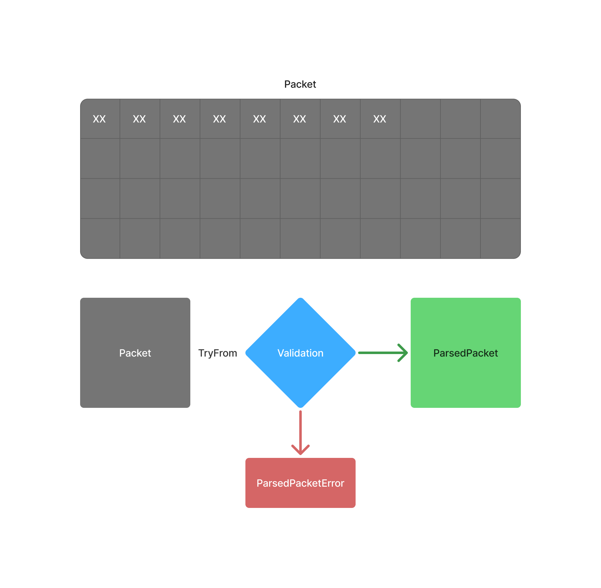

# Data validation procedure

When we receive a packet, we use TryFrom to apply several validation steps to it.
If the validations succeed, the function returns a structured representation of the packet or a part of it.
If the validations fail, it returns a custom error, implemented using the [thiserror crate](https://crates.io/crates/thiserror). 