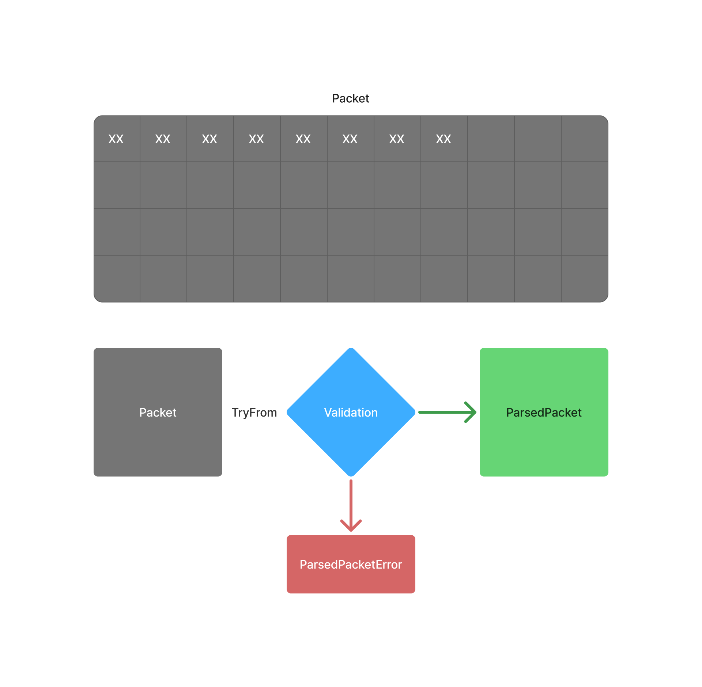

# Data validation procedure



When we receive a packet, we use `TryFrom` to apply several validation steps to it.
If the validations succeed, the function returns a structured representation of the packet or a part of it.
If the validations fail, it returns a custom error, implemented using the [thiserror crate](https://crates.io/crates/thiserror).

Every protocol in the crate follows this same shape, and the module layout
mirrors it:

| Module | Responsibility |
| --- | --- |
| `src/errors/<layer>/<proto>.rs` | The protocol's error enum (`thiserror`) |
| `src/checks/<layer>/<proto>.rs` | Pure validation functions — no allocation, no decoding |
| `src/parse/<layer>/protocols/<proto>.rs` | The `TryFrom<&[u8]>` implementation and the struct it builds |
| `src/displays/<layer>/...` | `Display` implementations, kept out of the parsers |

Checks come first, extraction second. A parser that interleaves the two ends up
half-building a structure it then has to throw away, and — worse — ends up with
validation rules that only exist implicitly, in the order the fields happen to be
read.

## Validate, then extract

```rust
impl<'a> TryFrom<&'a [u8]> for SomePacket<'a> {
    type Error = SomeError;

    fn try_from(bytes: &'a [u8]) -> Result<Self, Self::Error> {
        // 1. length and structural checks
        check_min_length(bytes)?;
        // 2. field coherence checks
        check_reserved_bits(bytes)?;
        // 3. only now, build the structure — borrowing, not copying
        Ok(SomePacket { /* … */ })
    }
}
```

Each step returns a **specific** error variant. `PacketTooShort(3)` and
`InvalidReservedField` tell you different things about the traffic; a single
`InvalidPacket` variant would tell you nothing.

## Probing versus dispatching

There are two ways to reach a protocol's `TryFrom`, and they are not
interchangeable.

**Dispatching** — the layer below announced what comes next, so we call exactly
one parser:

```rust
Internet::try_from_parts(ethertype, payload)
Transport::try_from_parts(payload_protocol, payload)
```

**Probing** — nothing announced anything, so we try parsers until one accepts:

```rust
Internet::try_from(payload)
Application::try_from(payload)
```

Dispatching is strictly more informative. When the EtherType says IPv4 and the
IPv4 parser refuses the bytes, we know the packet is *corrupt*. When we probe and
every parser refuses, we cannot tell corruption from an unsupported protocol —
the answer is the same "nothing matched".

That is exactly the difference between the two `None` cases described in
[the `PacketFlow` chapter](./packet_flow.md), and it is why the internal parsing
path always dispatches when the information is available. The probing entry
points remain public because they are useful when you hand the crate a bare
payload with no context — a TCP payload you already extracted, for instance.

## Fail-soft is decided one level up

The parsers themselves are strict: `TryFrom` returns `Err` on anything it cannot
justify. Graceful degradation is not implemented inside them, it is implemented
by `PacketFlow`, which catches the error and turns it into
`corrupted: Some(CorruptedLayer { .. })`.

Keeping the two separate means a parser used on its own stays honest — it tells
you the bytes are wrong — while a full-packet parse stays usable on real,
messy traffic.

## Zero-copy is part of the contract

Validation must not allocate to decide. Parsers borrow from the input buffer
(`&'a [u8]`) and store slices, not `Vec`s, for the L2/L3/L4 path. A few
application parsers (DNS name decompression, HTTP, SNMP) genuinely need to
allocate, and tunnel recursion boxes the inner flow — those are the documented
exceptions, not the norm.

The next four chapters walk through the layers in order: what each one validates,
what it extracts, and what it hands to the layer above.
