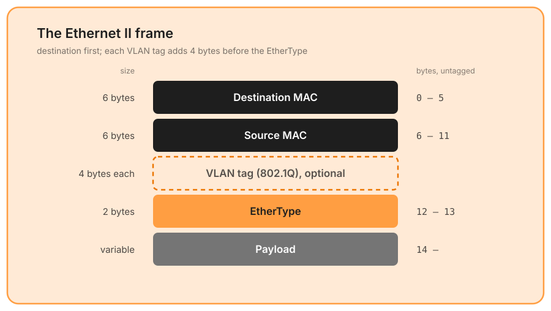
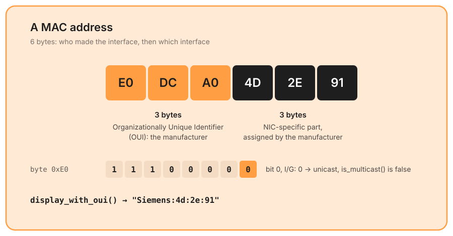
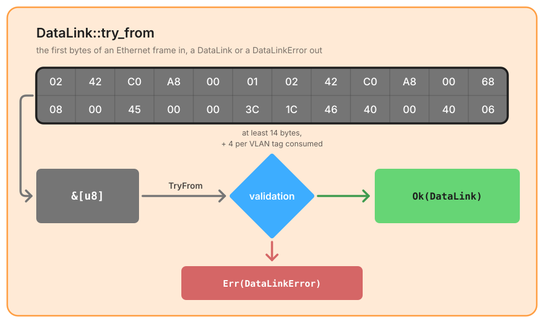
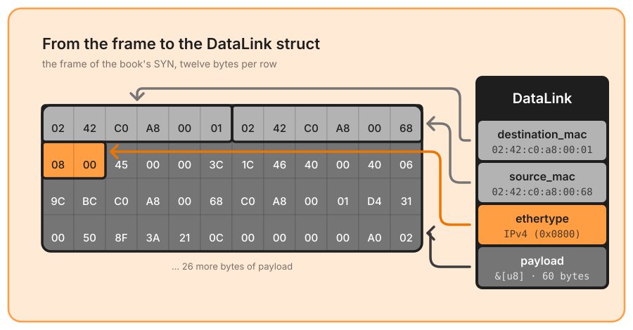

# Ethernet

LINKTYPE 1, the format of most captures. The [data link](./data_link.md) page explains how the LINKTYPE selects this decoder.

## **🧩 Understanding the Ethernet Frame**
The Data Link Layer is responsible for **frame-level communication** between devices on the same network segment. In an **Ethernet frame**, the structure is as follows:



The main components are:
1. **Destination MAC Address** (6 bytes) - the unique physical identifier of the receiving network hardware.
2. **Source MAC Address** (6 bytes)
3. **EtherType** (2 bytes) – determines the protocol encapsulated in the payload.
4. **Payload** (variable length) – contains the encapsulated network-layer packet (IPv4, ARP, etc.).

---

### **Breaking Down the MAC Address Structure**
To parse MAC addresses correctly, we need to ensure that:
- They are always **6 bytes long**.
- They are formatted properly for readability.
- We extract **Organizationally Unique Identifiers (OUI)** to identify the manufacturer.

**MAC Address Structure:**


```rust
pub struct MacAddress(pub [u8; 6]);

impl MacAddress {
    pub const fn is_broadcast(&self) -> bool;
    /// The I/G bit of the first byte: broadcast is multicast too.
    pub const fn is_multicast(&self) -> bool;
    pub const fn is_unicast(&self) -> bool;
    /// "ASUSTek:3c:4d:5e" when the OUI is known (the manufacturer replaces
    /// the first three bytes), "00:1a:2b:3c:4d:5e" otherwise.
    pub fn display_with_oui(&self) -> String;
    pub fn get_oui(&self) -> Oui;
}
```

The OUI table is embedded in the crate: no file to load, no network lookup. It is also short: a `match` on seven prefixes (ASUSTek, Intel, Sagemcom, three Siemens prefixes and `PnMc`, the PROFINET multicast prefix `01:0e:cf`), not the IEEE registry. Any other prefix is `Oui::Unknown`, and `display_with_oui()` falls back to the plain address.

---

### **Breaking Down the EtherType Field**
The **EtherType** is a 2-byte field that defines the **type of payload** carried by the frame.

📌 **Key Considerations:**
- Extract the 2-byte **big-endian** value.
- Map **well-known EtherTypes** (IPv4, IPv6, ARP, etc.).
- Allow handling of **unknown protocols** without failure: `Ethertype(pub u16)` is a plain newtype, an unknown value is preserved, and `static_name()` returns `None` for it.

📌 **Example of Well-Known EtherTypes:**

| EtherType (Hex) | Protocol |
|----------------|----------|
| `0x0800` | IPv4 |
| `0x86DD` | IPv6 |
| `0x0806` | ARP |
| `0x8892` | Profinet |
| `0x88CC` | LLDP |
| `0x8100` | VLAN tag (802.1Q) |
| `0x88A8` / `0x9100` | Service tag (802.1ad / legacy QinQ) |

Naming is not decoding. Only the four values that `NetworkProtocol` maps (IPv4, IPv6, ARP, Profinet) reach an L3 decoder; LLDP, MRP (`0x88E3`) and the rest of the name table only get a readable name, and `internet` stays `None`. The TPIDs never survive as the parsed `ethertype`: the parser consumes the tags they announce.

---

### **VLAN tags**

When the EtherType is a **TPID** (`0x8100`, `0x88A8` or `0x9100`), the next 4 bytes are a VLAN tag (TCI + the following EtherType), and that EtherType may itself be a TPID: 802.1ad puts an S-tag in front of the C-tag, and some equipment stacks two `0x8100`. The parser **consumes the whole stack** so that `ethertype` and `payload` always describe the real layer 3:

```rust
#[non_exhaustive]
pub struct DataLink<'a> {
    pub destination_mac: MacAddress,
    pub source_mac: MacAddress,
    /// The innermost tag (the customer VLAN), if any.
    pub vlan: Option<VlanTag>,
    /// The whole stack, outermost first (S-tag then C-tag).
    pub vlan_stack: VlanStack<'a>,
    /// The real layer-3 EtherType, after the tags.
    pub ethertype: Ethertype,
    pub payload: &'a [u8],
}

pub struct VlanTag {
    pub id: u16,      // VLAN identifier (12 bits)
    pub pcp: u8,      // priority code point (3 bits)
    pub dei: bool,    // drop eligible indicator
    pub inner_ethertype: Ethertype,
}
```

`vlan_stack.outer()` gives the S-VLAN, `vlan_stack.inner()` the same tag as `vlan`, and `vlan_stack.iter()` walks the stack from outer to inner. `VlanStack` is a zero-copy view over the tag bytes of the frame: no allocation, whatever the depth ([#82](https://github.com/Akmot9/Packet-parser/issues/82)). It takes part in equality and hashing, so two frames that differ only by their S-tag are two flows, and it is serialized only when at least two tags are stacked, so the JSON of untagged and single-tagged frames did not change when it appeared in 11.0.0.

The untagged case is the hot path and stays a straight line; the stack is unrolled in a separate `#[inline(never)]` function, because unrolling it inline cost about 13 ns on every frame, tagged or not (measured on the reference packet).

---

## **📌 Steps Taken to Parse the Ethernet Frame**
To correctly extract this information, I followed these key steps:



### **Validations**
While parsing, I implemented **validations** to ensure the raw packet is coherent.

📌 **Validations Performed:**

✅ **Frame minimum length** – the packet is at least **14 bytes** (`MAC_DST + MAC_SRC + EtherType`), otherwise `DataLinkError::DataLinkTooShort { required, actual }`.  
✅ **VLAN stack length** – re-checked **at each tag consumed**: `14 + 4 × tags` bytes, so a frame truncated in the middle of the stack reports `DataLinkTooShort` instead of an out-of-bounds access.  
✅ **MAC address length** – exactly **6 bytes**, `MacParseError::InvalidLength` otherwise (unreachable from `DataLink::try_from`, since the frame length is already proven; it protects the direct `MacAddress::try_from`).  

These are the errors of `DataLink::try_from` called directly. Through `parse`, the Ethernet decoder converts them into `LinkLayerError::Truncated` (see [One error path](./data_link.md#one-error-path)): since 11.0.0, `DataLinkError` is no longer part of `ParseError`.

The EtherType is *not* validated: an unknown value is a valid frame carrying a protocol we do not decode, and the internet layer will simply be `None`.

```rust
/// Ethernet II header: two MACs and an EtherType.
const DATALINK_HEADER_LEN: usize = 14;

impl<'a> TryFrom<&'a [u8]> for DataLink<'a> {
    type Error = DataLinkError;

    fn try_from(packets: &'a [u8]) -> Result<Self, Self::Error> {
        validate_data_link_length(packets)?;

        let destination_mac = MacAddress::try_from(&packets[0..6])?;
        let source_mac = MacAddress::try_from(&packets[6..12])?;

        let raw_ethertype = u16::from_be_bytes([packets[12], packets[13]]);
        if VlanTag::is_tpid(raw_ethertype) {
            return Self::parse_tagged(packets, destination_mac, source_mac, raw_ethertype);
        }

        Ok(DataLink {
            destination_mac,
            source_mac,
            vlan: None,
            vlan_stack: VlanStack::default(),
            ethertype: Ethertype::from(raw_ethertype),
            payload: &packets[DATALINK_HEADER_LEN..],
        })
    }
}
```

Called directly, `DataLink::try_from` **assumes Ethernet**: it checks lengths, never that the bytes *are* Ethernet, so a Linux SLL frame comes back `Ok` with fabricated MAC addresses. It is kept for compatibility and announced for removal in a future major release. Inside the crate it is only called where something declares Ethernet: the LINKTYPE (Ethernet, 802.3br express mPackets) or a tunnel header (VXLAN, and GRE or Geneve announcing `0x6558`).

### **Structuring the Parsed Frame**
After extracting all components, I structured the parsed frame in a clear format. This makes it easier to **analyze, debug, and process packets** dynamically.


