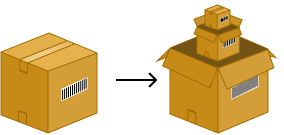

# Introduction

**Packet Parser** is a Rust library designed for parsing network frames.  
This book explains how I developed it, its internal architecture, so you can contribute.

## Key Features

- **Multi-layer support**: Supports parsing of data link, network, transport, and application layers.
- **Data validation**: Built-in mechanisms to ensure packet integrity.
- **Precise error management**: Each layer has its own dedicated error types for better debugging.
- **Optimized performance**: Integrated benchmarking using Criterion.
- **Extensibility**: Modular architecture that allows easy addition of new protocols.

## Purpose of this crate

The goal of this crate is to provide a function that transforms a Packet or a list of bytes to be more precice into any type of packet structure or an error if you are just getting fooled and reciev uncohrent bytes.   

- It is **not restricted to a specific layer**: You can pass a TCP payload, and it will return an HTTP, TLS, NTP, or other applicable protocol structure.  
- You can provide a **full network packet**, and it will return a structured representation containing **data link, network, transport, and application layers**.

To explain how i made this crate les dive into packet parsing my passion.

have to know what do i call a packet because thats what we are stating from.

then we'll se how i parse this packet:

Parsing procedure

now that we know how to parse packet. let's see how we retrieve the **network layer structure** as an example, so you can understand the **data validation procedure** I use for every struct in this crate: `TryFrom::`.  

