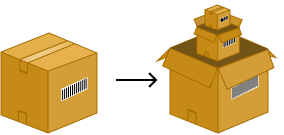

# Introduction

**Packet Parser** is a Rust library designed for parsing network frames.
This book explains how I developed it, its internal architecture, so you can contribute.

## Key Features

- **Multi-layer support**: link, internet, transport and application layers.
- **Zero-copy**: `PacketFlow` borrows the input buffer — no payload is copied
  for L2/L3/L4. Some application parsers (DNS, HTTP, SNMP…) and tunnel
  recursion do allocate.
- **Fail-closed on the link layer**: the LINKTYPE is supplied by the caller,
  never guessed from the bytes. An unsupported one is an error, not a lie.
- **Fail-soft above it**: an unsupported or malformed upper layer leaves that
  layer `None` instead of failing the whole parse — and says which one broke.
- **Precise error management**: each layer has its own dedicated error types,
  built with [`thiserror`](https://crates.io/crates/thiserror).
- **Tunnels**: one wire packet can yield several flow levels (`inner`).
- **Optimized performance**: benchmarked per version, with an optional
  per-layer timing feature.
- **Extensibility**: modular architecture that allows easy addition of new
  protocols — see [Adding a protocol](./adding_a_protocol.md).

## Purpose of this crate

The goal of this crate is to provide a function that transforms a packet — a
list of bytes, to be precise — into a structured representation of that packet,
or into an error if you are just getting fooled and received incoherent bytes.

- It is **not restricted to a specific layer**: you can pass a TCP payload, and
  it will tell you it is HTTP, TLS, NTP, or another applicable protocol.
- You can provide a **full network packet**, and it will return a structured
  representation containing **data link, internet, transport and application
  layers**.

## What changed since the first version of this book

The book originally described a `ParsedPacket` structure that either parsed the
whole packet or failed. Real captures killed that design. Two things replaced it:

- `ParsedPacket` became [`PacketFlow`](./packet_flow.md), which is *partial by
  construction*: only the link layer is mandatory, and the others are `Option`s.
- The link layer stopped being "Ethernet, obviously". The caller now passes the
  capture's [LINKTYPE](./link_types.md) to `parse`, because a capture on the
  Linux `any` interface is not Ethernet and silently pretending otherwise
  produces MAC addresses that never existed on the wire.

## Roadmap of this book

To explain how I made this crate, let's dive into packet parsing — my passion.

First, [what do I call a packet](./packet.md), because that is what we start
from. Then, [what a parse returns](./packet_flow.md) and
[how the link type is chosen](./link_types.md).

Then we look at how we retrieve each layer's structure, so you can understand
the **data validation procedure** I use for every struct in this crate:
`TryFrom`.
