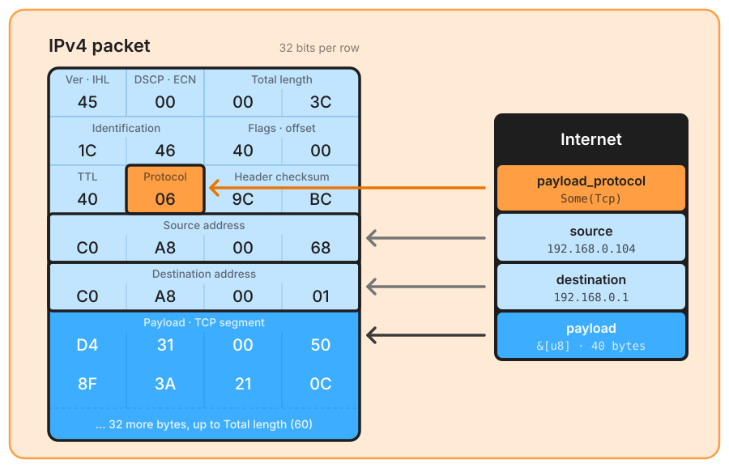

# IPv4

Announced by EtherType `0x0800`, or directly by a RAW IP capture, and parsed by the [internet layer](./network.md).

The **Protocol** byte plays the part the EtherType played one layer down: the internet layer does not parse what follows, it turns `6` into `payload_protocol: Some(Tcp)`, the announcement the [transport layer](./transport.md) dispatches on (`None` for a fragment, see [below](#fragments)). The bytes are those of a typical Linux TCP SYN, and the struct shows what `Internet::try_from_network_parts` returns for them.

✅ **Minimum length** – at least **20 bytes**, otherwise `Ipv4Error::InvalidLength`.  
✅ **Version** – the high nibble is **4**, otherwise `InvalidVersion`.  
✅ **Header length** – `IHL × 4` is between **20 and 60** bytes (IHL 5..=15), otherwise `InvalidHeaderLength`.  
✅ **Header available** – the buffer holds the whole header, options included, otherwise `InvalidLength`.  
✅ **Total length** – `total_length` is at least the header length and at most the buffer length, otherwise `InvalidTotalLength`. The payload is `data[header_len..total_length]`: Ethernet padding after a short IP packet is *not* handed to the transport layer.  

The upper bound has a consequence: a packet cut by the capture's snapshot length fails it and is reported in `corrupted`, although nothing was wrong on the wire. `parse` receives the captured bytes only, so a truncated capture and a lying header look the same.

Options are neither decoded nor validated: `Ipv4Packet::options` holds their raw bytes, `data[20..header_len]`, empty when IHL is 5.

The header checksum is **not** verified here: on a sender-side capture with hardware offloading it is often uncomputed, and a mandatory check would reject perfectly healthy traffic. `packet_parser::checksum::verify_ipv4_header_checksum(&[u8]) -> Option<bool>` is available when the context allows it: give it the IP packet, it returns `None` when the header itself is unreadable.

The rest of the header is reached through `details` (`InternetDetails::Ipv4`): `ttl`, `identification`, `protocol`, `header_checksum`, and typed accessors. `dscp()` returns a `Dscp` that displays its IANA name when it has one (`EF (46)`, `AF41 (34)`), `ecn()` an `Ecn` (`NotEct`, `Ect1`, `Ect0`, `Ce`, RFC 3168). Both types come from the `dscp_ecn` module that `Ipv6Packet` shares for its Traffic Class.

## Fragments

The crate does no IP reassembly. For a fragmented IPv4 packet (MF flag set or non-zero offset), `payload_protocol` is set to `None` so the transport layer is **not** parsed from incomplete data: a TCP header read from the second fragment of a datagram would be garbage with valid-looking ports. The first fragment is skipped too, although it does start with the L4 header: a UDP length field covers the whole datagram, so UDP's exact-length check would report a healthy fragment as corrupt, and the application probes would see a cut payload. The cost is that a fragmented packet has no `transport` and no ports. `Ipv4Packet::is_fragmented()`, `more_fragments()`, `fragment_offset()` and `is_non_initial_fragment()` expose the flags through `details`.
