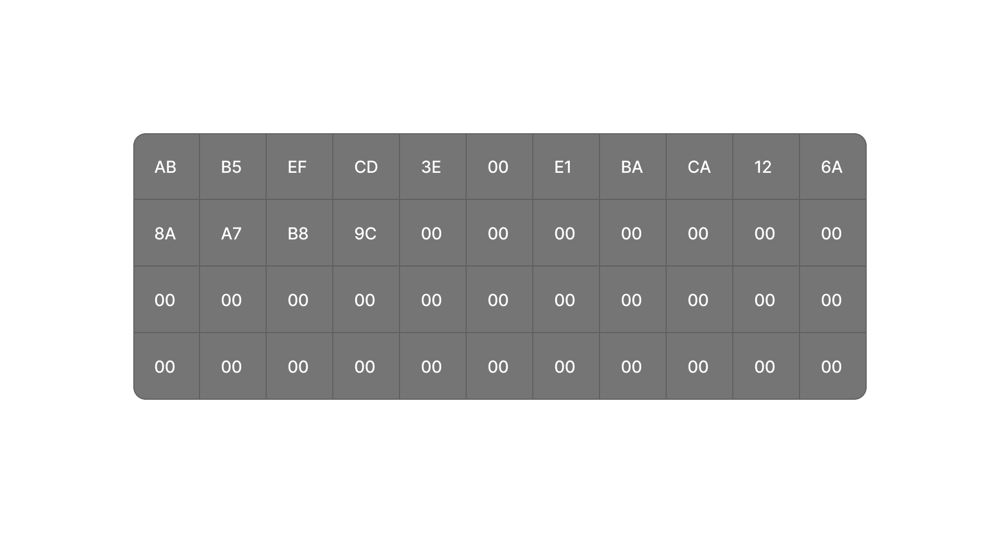
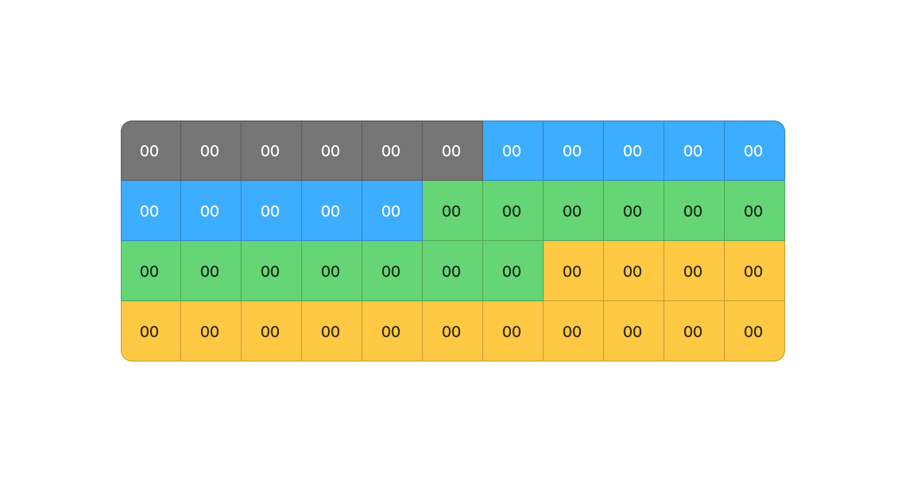
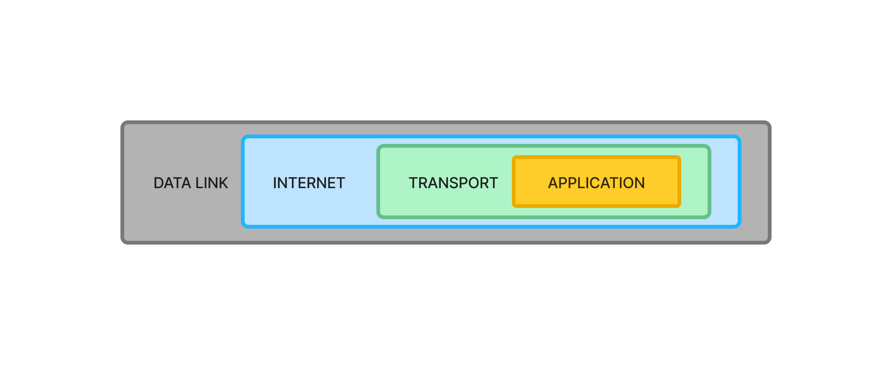
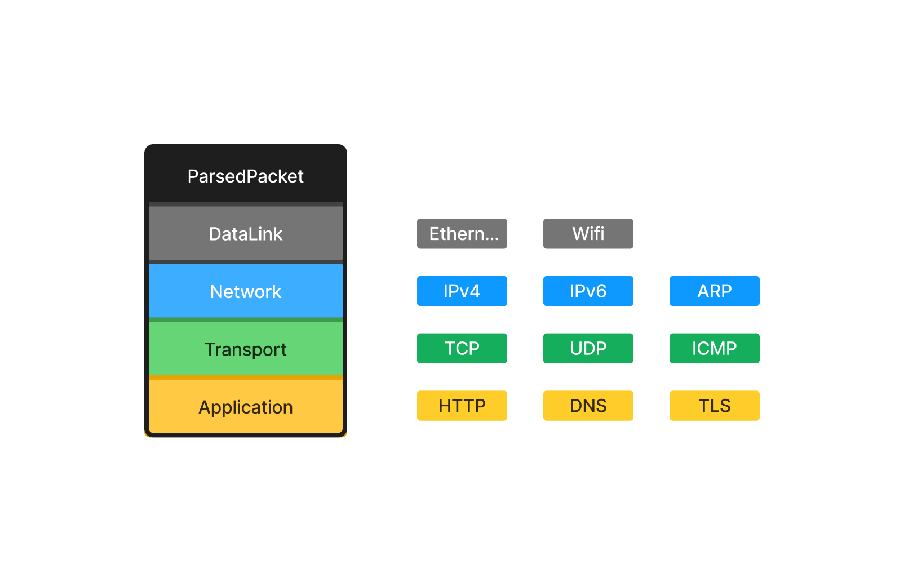
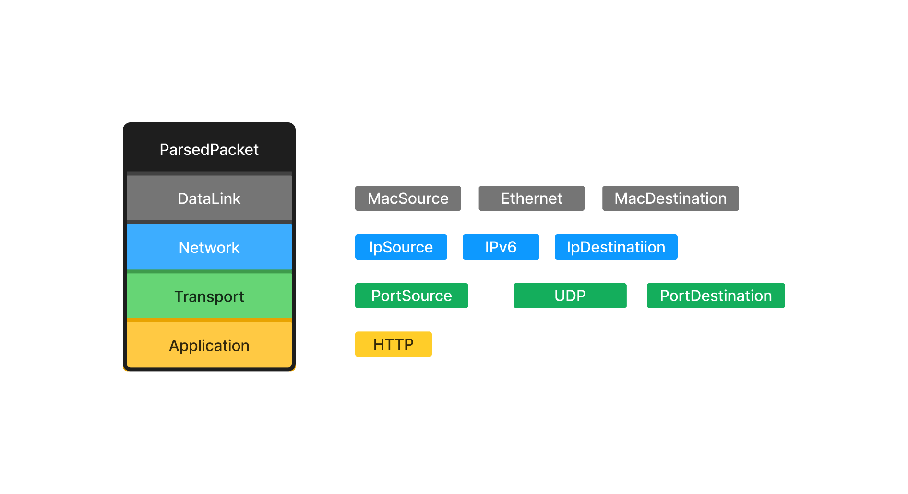
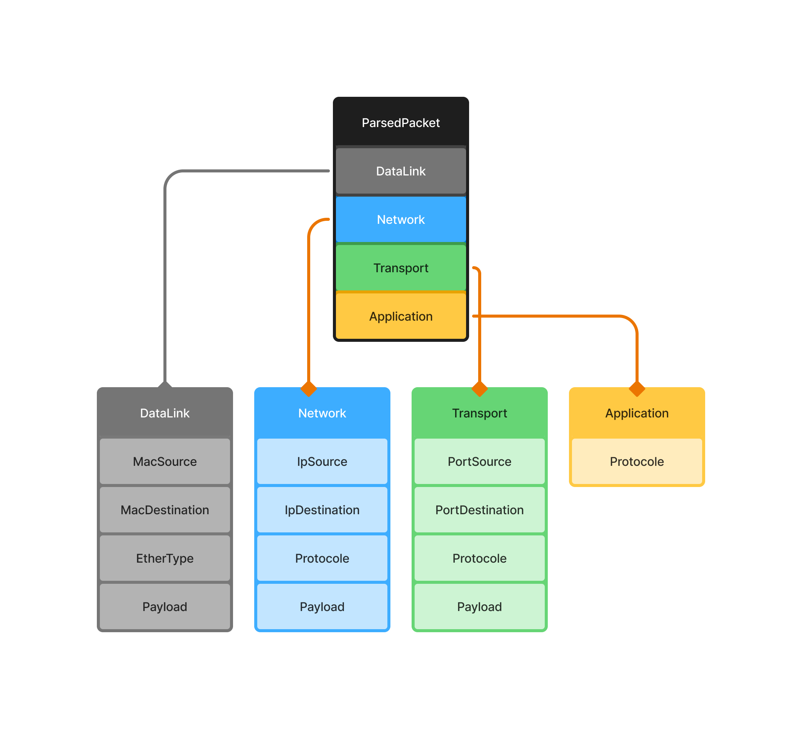
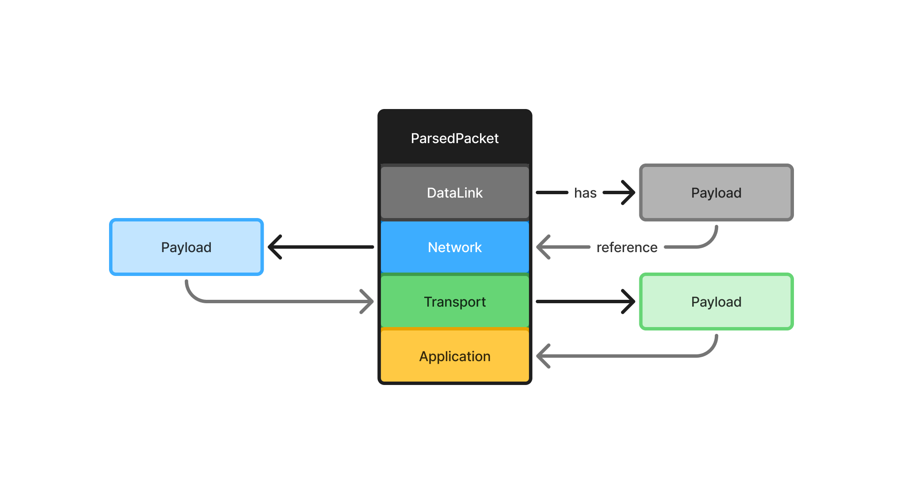

# Packet Structure and Parsing Approach

## What is a Packet?
A network packet is a sequence of bytes transmitted over a network. Here's an example of a raw packet in hexadecimal format:



A **packet** is essentially a **list of bytes** representing network data.
For example:

```rust
let packet: &[u8] = &[0x00, 0x11, 0x22, 0x33, 0x44, 0x55, /* other bytes */];
```

It is preferable to **reference** the packet (`&[u8]`) rather than copying it to avoid unnecessary memory usage and improve performance.

This is not only a performance detail: it is the reason the whole parsed
structure carries a lifetime. `PacketFlow<'a>` borrows the buffer you passed in,
so no L2/L3/L4 payload is ever copied. When you need to keep a flow after the
buffer is gone, you [convert it to an owned form](./owned.md) explicitly.

---
## 🎨 Identifying Protocols in the Packet

Each protocol occupies a specific part of the packet. By analyzing the bytes, we can identify different layers.



---

## 🪆 Protocols are Nested (Like Russian Dolls)
A network packet is structured as a series of encapsulated layers: each layer contains a protocol that encapsulates the next.


Some packets take this literally and carry **a whole other packet** inside their
payload. That is a tunnel, and it produces several flow levels from a single
wire packet — see [Tunnels](./tunnels.md).

---

## Layered Structure
Once parsed, a packet is structured into **four layers**, following the OSI model:



The **link layer** is always present, while the others depend on the packet type
— and on whether their bytes made sense.

---

## 🔗 How Layers Interact with Addresses and Entry/Exit Points
Each layer contains specific information to identify **source and destination addresses**.


Those fields are what defines the *identity* of a flow. `PacketFlow` takes that
seriously: its `PartialEq`, `Eq` and `Hash` implementations compare addresses,
protocols and ports, and deliberately **ignore the payloads**. Two packets of the
same conversation carrying different data therefore compare equal and hash
identically, which is exactly what you want when building a flow matrix.

---

## 🧐 Detailed Breakdown of Parsed Structures
Each protocol has its own structure with unique fields.



---
## Parsing Strategy Based on Payloads

Parsing is determined by the payloads extracted at each stage.



Each layer parses the **payload of the layer below it**, and hands its own
payload to the layer above. The link layer exposes it as `network_payload()`,
the internet layer as `payload`, the transport layer as `payload`.

## Independent Layer Parsing

Each layer must be **parsed independently** from the others.
We do **not** use information from one layer to infer details about another.

### **Why?**
- **Security:** Attackers can manipulate packet fields (e.g., changing port numbers).
- **Flexibility:** Some protocols do not strictly follow conventional port assignments.
- **Reliability:** Parsing should be based on raw data, not assumptions.

For example, **we do not parse an application-layer protocol based on the transport-layer port number**.
Just because a packet has **port 80** does not mean it contains **HTTP**—it could be anything.

### Where that rule bends, and why

Experience with real captures forced one nuance. A few application protocols
have a *weak signature*: a handful of ASCII commands, or a header short enough
that random bytes match it. Probing those blindly labels unrelated traffic.

So detection now has two regimes:

- **Strong signature** → probed on content, on any port (TLS, DNS, QUIC,
  S7Comm over TCP…).
- **Weak signature** → parser validation **and** the protocol's standard control
  port (FTP on TCP/21, SMTP on 25/587, NNTP on 119, DHCPv6, SNMP…).

The rule "never infer a layer from another layer" still holds for *decoding*.
The port is used only as a **guard against false positives**, never as the sole
reason to claim a protocol. Details are in the
[application layer chapter](./application.md).
