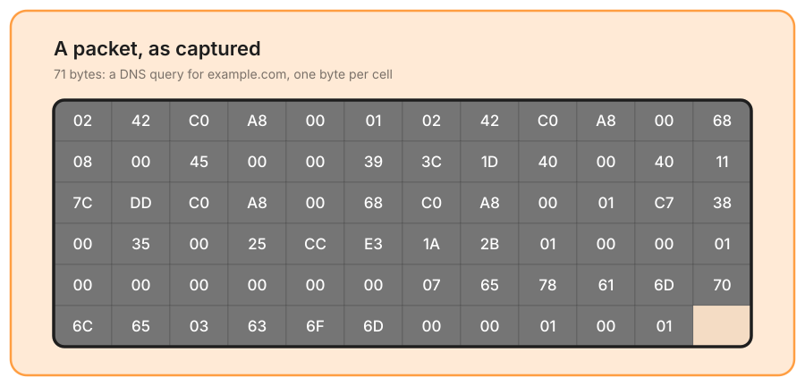
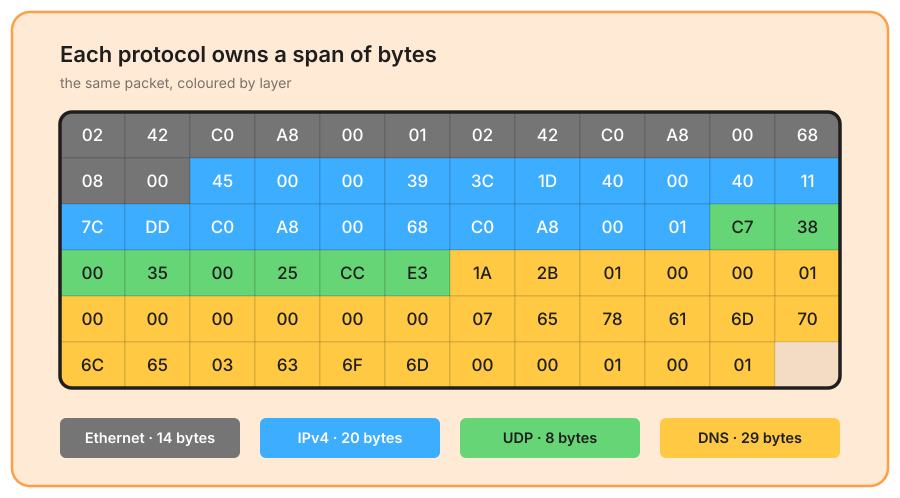
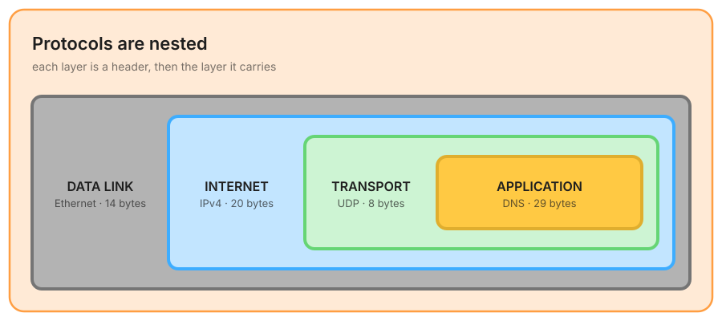
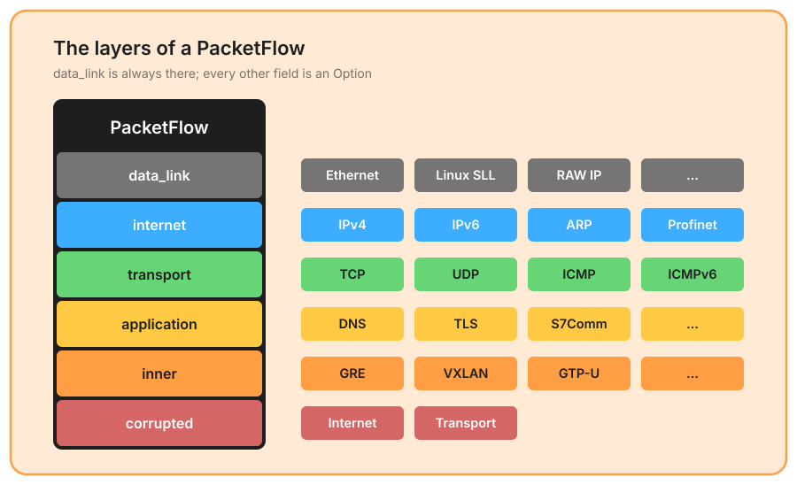
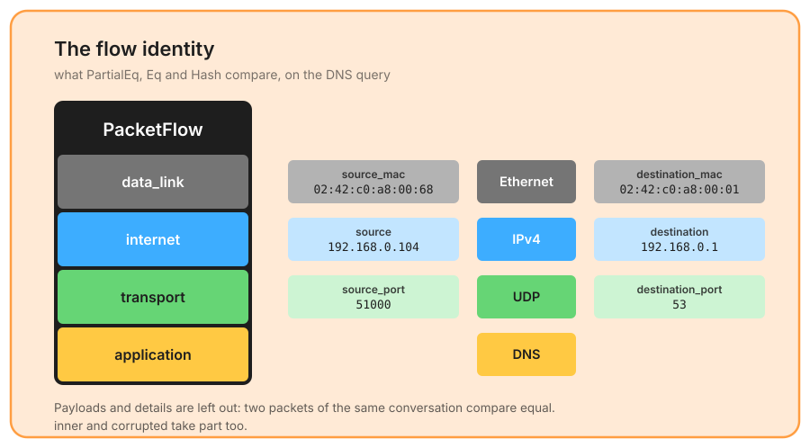
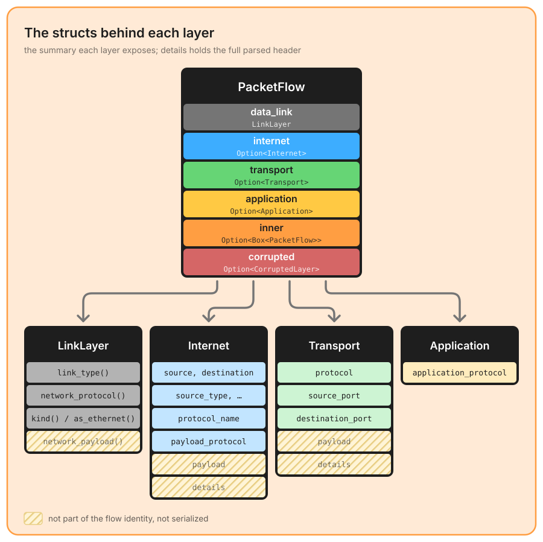
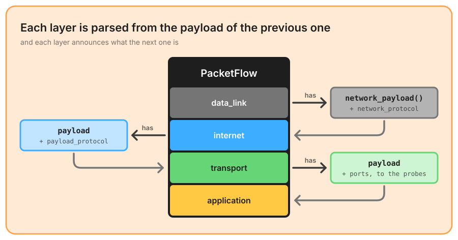

# Packet Structure and Parsing Approach

## What is a Packet?
A network packet is a sequence of bytes transmitted over a network. Here's an example of a raw packet in hexadecimal format:



A **packet** is essentially a **list of bytes** representing network data.  
For example:

```rust
let packet: &[u8] = &[0x02, 0x42, 0xc0, 0xa8, 0x00, 0x01, /* 65 more bytes */];
```

It is preferable to **reference** the packet (`&[u8]`) rather than copying it to avoid unnecessary memory usage and improve performance. This is the founding rule of the crate: **the parsed structures borrow the packet, they never copy it**. Every parsed struct carries a lifetime `'a` tied to the input buffer.

--- 
## 🎨 Identifying Protocols in the Packet  

Each protocol occupies a specific part of the packet. By analyzing the bytes, we can identify different layers.



---

## 🪆 Protocols are Nested (Like Russian Dolls)  
A network packet is structured as a series of encapsulated layers: each layer contains a protocol that encapsulates the next.


---

## `PacketFlow` Layered Structure
Once parsed, a packet is structured into **four layers**, following the OSI model:


The **Data Link Layer** is always present, while the others depend on the packet type.

Here is the actual struct:

```rust
pub struct PacketFlow<'a> {
    /// Link layer (mandatory), tagged with its canonical LINKTYPE.
    pub data_link: LinkLayer<'a>,
    /// Internet layer (optional).
    pub internet: Option<Internet<'a>>,
    /// Transport layer (optional).
    pub transport: Option<Transport<'a>>,
    /// Application layer (optional, best-effort).
    pub application: Option<Application>,
    /// Encapsulated packet, when this flow is a tunnel (CAPWAP, GRE, VXLAN...).
    pub inner: Option<Box<PacketFlow<'a>>>,
    /// Present when a recognized layer carried invalid bytes.
    pub corrupted: Option<CorruptedLayer>,
}
```

Two fields were not in the original design and deserve a word:

- **`inner`**: some packets carry a *whole other packet* inside their payload. When a tunnel is recognized, its name goes into `application` and the encapsulated packet is parsed recursively into `inner`. See the [tunnels chapter](./tunnels.md).
- **`corrupted`**: a layer that was *recognized* (the EtherType said IPv4, the IP header said TCP) but whose bytes are invalid does not fail the whole parse. The layers above it are kept, the problem is reported here. See [getting started](./getting_started.md#reading-the-outcome).

---

## 🔗 How Layers Interact with Addresses and Entry/Exit Points  
Each layer contains specific information to identify **source and destination addresses**.


This is what I call the **flow identity**: MAC addresses, IP addresses, protocols, ports. `PacketFlow` implements `PartialEq`, `Eq` and `Hash` on this identity only, **not on the raw bytes**: payloads are deliberately ignored. Two packets of the same conversation carrying different data compare equal and hash identically, which is exactly what you want to build a flow table with a `HashMap<PacketFlowOwned, Stats>`.

---

## 🧐 Detailed Breakdown of Parsed Structures  
Each layer has its own structure with unique fields.



Each layer exposes two levels of information:

- the **flattened summary** you see in the diagram (`source`, `destination`, `protocol_name`, `source_port`...), which defines the identity of the layer and is what gets serialized;
- a **`details`** field (`InternetDetails`, `TransportDetails`) holding the full parsed header (`Ipv4Packet`, `TcpPacket`, `IcmpPacket`...), so you never need to re-parse the payload to reach the TTL, the DSCP or the TCP flags. `details` is ignored by equality, hashing and serialization.

The data link layer is the exception: `LinkLayer` is *format-neutral* (Ethernet, RAW IP, Linux cooked capture...), and the format-specific view is reached through `as_ethernet()`, `as_linux_sll()`, etc. See the [data link chapter](./data_link.md).

---
## Parsing Strategy Based on Payloads  
 
Parsing is determined by the payloads extracted at each stage.



The pipeline is **layered and progressive**: each layer is parsed from the payload of the previous one, and each layer announces what the next one is.

| Step | Input | What tells us the next protocol | Output |
| --- | --- | --- | --- |
| Link | LINKTYPE + packet bytes | the caller (LINKTYPE) | `LinkLayer` + `NetworkProtocol` + L3 payload |
| Internet | `NetworkProtocol` + L3 payload | EtherType / SLL protocol field | `Internet` + `payload_protocol` + L4 payload |
| Transport | `TransportProtocol` + L4 payload | IP protocol number / next header | `Transport` + ports + L7 payload |
| Application | `Transport` (ports + payload) | **content probes**, guarded by transport and sometimes by port | `Application { application_protocol }` |

### The engine, end to end

The table gives the principle. Here is how `parse` chains it:


Everything above `DecodedLink` depends on the capture format, and is the only part that can return `Err` ([data link chapter](./data_link.md)). Everything below it is one pipeline, shared by every LINKTYPE and by every tunnel level. It is a single function, `parse_decoded_into`, quoted here with its comments removed:

```rust
let (data_link, network_protocol, network_payload) = decoded.into_parts();
let (internet, l3_corruption) = sink.time(Stage::L3, || {
    Self::parse_l3(network_protocol, network_payload)
});
let (transport, l4_corruption) = sink.time(Stage::L4, || Self::parse_l4(internet.as_ref()));
let transport = match transport {
    Some(transport) if transport.is_anomalous_tcp() => {
        return Ok(Self::anomalous_tcp_flow(data_link, internet, transport, l3_corruption));
    }
    transport => transport,
};
let (application, inner) = sink.time(Stage::L7, || {
    let (application, inner) =
        Self::parse_l7_and_inner(internet.as_ref(), transport.as_ref(), depth, decode_as);
    (application.or_else(|| Self::detect_stp(&data_link)), inner)
});
Ok(PacketFlow {
    data_link, internet, transport, application, inner,
    corrupted: l3_corruption.or(l4_corruption),
})
```

Read from top to bottom:

- **Each stage turns its error into data.** `parse_l3` and `parse_l4` map `UnsupportedProtocol` to `None` and every other error to a `CorruptedLayer`, whose `error` is the error's `Display`. A layer that is `None` leaves nothing for the next one, so `corrupted` holds at most one report: `l3_corruption.or(l4_corruption)` is the first failure, and the only one.
- **An anomalous TCP segment leaves before L7**, in a `#[cold]` function: transport kept, anomaly reported, no application. Weaving that case into the common stages cost about 10 ns on every TCP segment ([transport chapter](./transport.md#tcp-validations)).
- **L7 has a fixed order.** First an IP-level tunnel (GRE, IP-in-IP), then a UDP tunnel (CAPWAP, VXLAN, Geneve, GTP-U), then the [dispatch table](./application.md), Decode As ports first. STP comes last, from the link layer, and only when nothing gave a label: a BPDU has no network layer to reach the table.
- **A tunnel re-enters at `DecodedLink`**, one level deeper, with the same Decode As ports ([tunnels chapter](./tunnels.md)). That recursion runs inside the L7 stage, which is where its time is counted.
- **`sink` is the timing**: a no-op for `parse`, a clock for `parse_timed`, so the measured path is the parsed path ([getting started](./getting_started.md#timing-benchmarks)).

## Independent Layer Parsing

Each layer must be **parsed independently** from the others.  
We do **not** use information from one layer to *decode* another.

### **Why?**
- **Security:** attackers can manipulate packet fields (e.g. changing port numbers).
- **Flexibility:** some protocols do not strictly follow conventional port assignments.
- **Reliability:** parsing should be based on raw data, not assumptions.

For example, **we do not label an application-layer protocol based on the transport-layer port number alone**.  
Just because a packet has **port 80** does not mean it contains **HTTP**: it could be anything.

The rule has one nuance, learned the hard way. Some protocols have a signature too weak to be recognized from their bytes alone: an FTP reply, an SMTP reply and an NNTP reply are byte-for-byte identical (`220 text CRLF`). For those, the standard port is used as a **guard in addition to the content check, never instead of it**: the label is only given when port *and* content agree. The [application chapter](./application.md) details this table.
