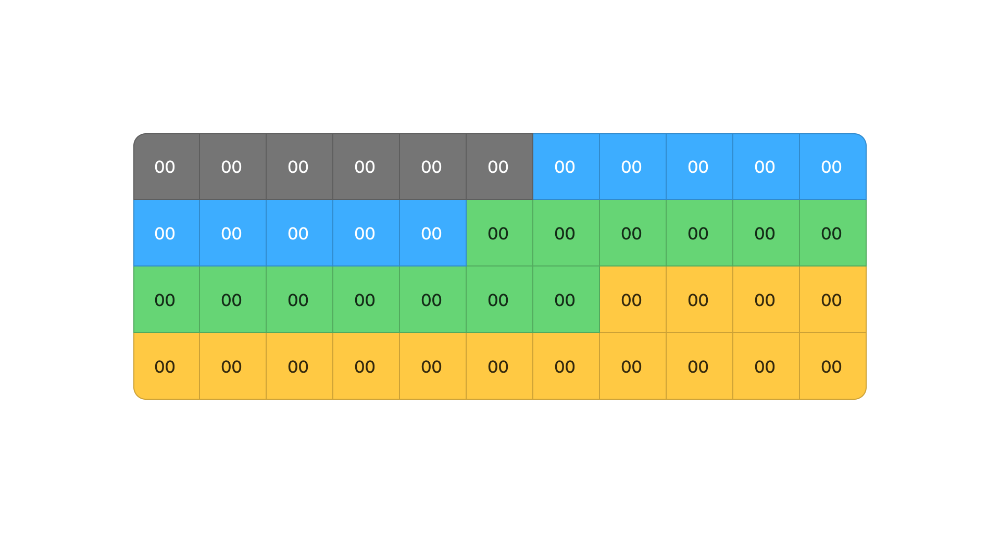

# Packet Structure and Parsing Approach

## What is a Packet?
A network packet is a sequence of bytes transmitted over a network. Here’s an example of a raw packet in hexadecimal format:


A **packet** is essentially a **list of bytes** representing network data.  
For example:

```rust
let packet: &[u8] = &[0x00, 0x11, 0x22, 0x33, 0x44, 0x55, /* other bytes */];
```

It is preferable to **reference** the packet (`&[u8]`) rather than copying it to avoid unnecessary memory usage and improve performance.

--- 
## 🎨 Identifying Protocols in the Packet  

Each protocol occupies a specific part of the packet. By analyzing the bytes, we can identify different layers.



---

## 🪆 Protocols are Nested (Like Russian Dolls)  
A network packet is structured as a series of encapsulated layers: each layer contains a protocol that encapsulates the next.


---

## `ParsedPacket` Layered Structure
Once parsed, a packet is structured into **four layers**, following the OSI model:


The **Data Link Layer** is always present, while the others depend on the packet type.

---

## 🔗 How Layers Interact with Addresses and Entry/Exit Points  
Each layer contains specific information to identify **source and destination addresses**.


---

## 🧐 Detailed Breakdown of Parsed Structures  
Each protocol has its own structure with unique fields.


---
## Parsing Strategy Based on Payloads  
 
Parsing is determined by the payloads extracted at each stage.


## Independent Layer Parsing

Each layer must be **parsed independently** from the others.  
We do **not** use information from one layer to infer details about another.  

### **Why?**
- **Security:** Attackers can manipulate packet fields (e.g., changing port numbers).
- **Flexibility:** Some protocols do not strictly follow conventional port assignments.
- **Reliability:** Parsing should be based on raw data, not assumptions.

For example, **we do not parse an application-layer protocol based on the transport-layer port number**.  
Just because a packet has **port 80** does not mean it contains **HTTP**—it could be anything.


