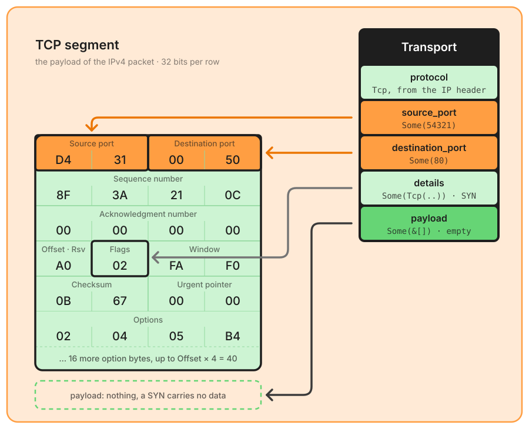

# TCP

IP protocol 6, parsed by the [transport layer](./transport.md).



These are the 40 bytes the [internet chapter](./ipv4.md) handed up as `payload`. Unlike the IPv4 Protocol byte, nothing in a TCP header names the protocol above it: the ports, in orange, are only a hint, which the [application table](./application.md) confirms against the content. `protocol` does not come from these bytes either, it is the internet layer's `payload_protocol`. The data offset `A` says the header is 10 words long, options included, so `payload` starts at byte 40: a SYN carries no data, and `payload` is `Some` of an empty slice.

`TcpPacket` holds the decoded `header: TcpHeader` and the `payload`, everything after `data_offset × 4` bytes. The header exposes every field: `data_offset` in 32-bit words, `reserved` as the three raw bits, one `bool` per flag from `ns` to `fin`. Options are not decoded: `options` is the raw slice between byte 20 and the end of the header.

Structural checks (an `Err` means "not a readable TCP header"):

✅ **Minimum length** – at least **20 bytes** (`TcpError::PacketTooShort`).  
✅ **Data offset** – between **5 and 15** words, 20 to 60 bytes (`TcpError::InvalidDataOffset`, carrying the value read).  
✅ **Header available** – the buffer holds the whole header, options included (`TcpError::PacketTooShort`).  

Semantic checks (the header is readable, `TryFrom` returns `Ok`, and the anomaly is exposed by `TcpPacket::anomaly()`):

⚠️ **SYN + FIN both set** – no conforming stack opens and closes a connection in the same segment. This is a classic scan and firewall-evasion signature (`TcpError::InvalidFlags { flags }`, with the whole flags byte).  
⚠️ **Reserved bits set** – the three bits between the data offset and NS. RFC 9293 §3.1 says they must be zero (`TcpError::ReservedBitsSet { bits }`). NS is decoded into `ns` and not checked.  

`anomaly()` names one anomaly: when both are present it returns `ReservedBitsSet`, which it checks first. `TcpPacket::is_anomalous()` gives the same verdict as a plain `bool`.

The pipeline **keeps** an anomalous transport, with its ports, and reports it in `corrupted` (`layer: Transport`, `error: "TCP error: Invalid TCP flags 0x03: SYN and FIN are both set"`). Before 11.0.0 such a segment lost its transport layer, which deprived the caller of the ports, so of any flow correlation, at the precise moment the packet is interesting ([#24](https://github.com/Akmot9/Packet-parser/issues/24)). Its payload stays in `transport.payload` but is *not* handed to the application probes nor to tunnel detection (`application` and `inner` are `None`): bytes that did not come from a conforming stack are not worth classifying. This case runs in a cold function outside the common pipeline: weaving it into the L4 and L7 stages cost about 10 ns on every TCP segment, for a case that almost never occurs.

```rust
if let Some(corrupted) = &flow.corrupted
    && corrupted.layer == CorruptedLayerKind::Transport
{
    match &flow.transport {
        None => { /* structural: unreadable header */ }
        Some(transport) => { /* semantic: ports usable, packet suspicious */ }
    }
}
```
